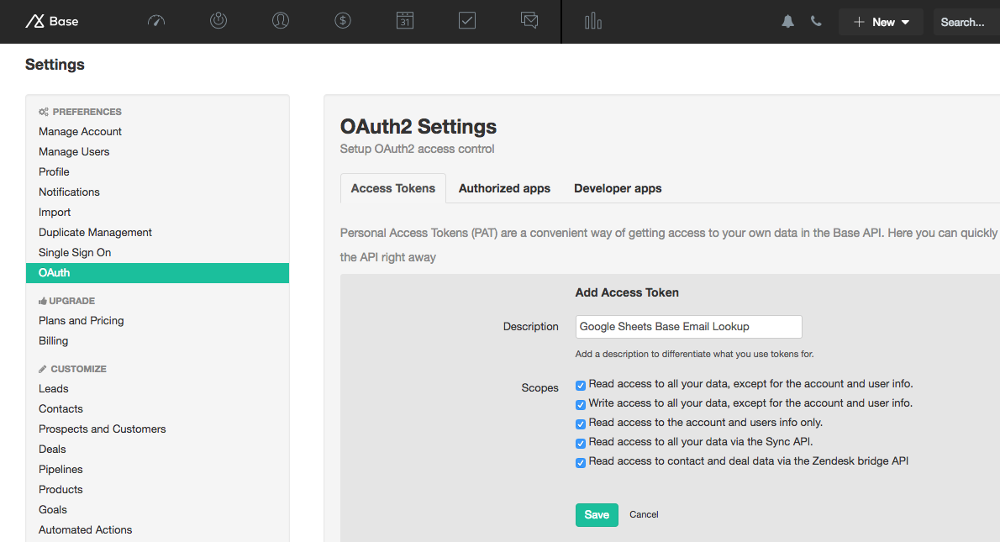
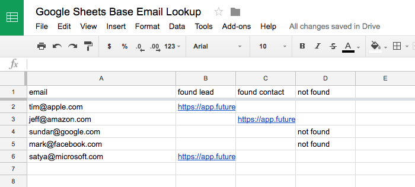

# Google Sheets/Base tools

Simple tools for doing Base things in Google Sheets:

1. Email lookup
2. Batch update fields

## Email lookup
Look up a list of emails in your Base account and get links to the Lead or Contact cards if they exist. Can return both a Lead and a Contact.

Note: if multiple records of the same type are found (for example, if multiple Leads exist with the same email), only the first URL will be displayed.

### Usage

1. Generate a personal access token in your Base account. If you're having trouble, check out the [documentation](https://developers.getbase.com/docs/rest/articles/oauth2/introduction).

2. Add the code to a new script file, replacing YOUR_API_KEY with the token you just generated.

3. List your emails in the first column. It's not important what the headers are, but it's important that the header row exists since the script starts on the second row.

4. Make sure you run lookupEmails in the editor and not the other functions.

5. Your results should populate in the spreadsheet.

## Batch update fields 
Update fields on multiple Leads/Contacts in your Base account. Only supports custom fields for now, but can be easily modified.

Note: if multiple records of the same type are found, only the first record will be updated (for example, if multiple Leads exist with the same email, only the first Lead will be updated).

### Usage

1. Follow steps 1 and 2 in the email lookup guide to add your code to a new script file, replacing YOUR_API_KEY with your personal access token.

2. List your emails in the first column, leave the second column empty, and put the values you want to update in the third column. It's not important what the header values of the first two rows are, but __the header of the third column has to match the name of the custom field you want to update__.

3. Make sure you run updateRecords in the editor and not the other functions.

4. The script will report its progress in the second column. There are five possible outcomes:

1. updated lead
2. updated contact
3. updated lead and contact
4. failed to update record (please check logs)
5. record not found

Things to note:

1. This script __will__ overwrite fields.
2. If your custom field is incorrectly spelled or doesn't exist in your Base account, the script will not catch this - it will report a successful update.
3. If your third column cell is empty, the script will push a blank string to the custom field, effectively erasing it.
