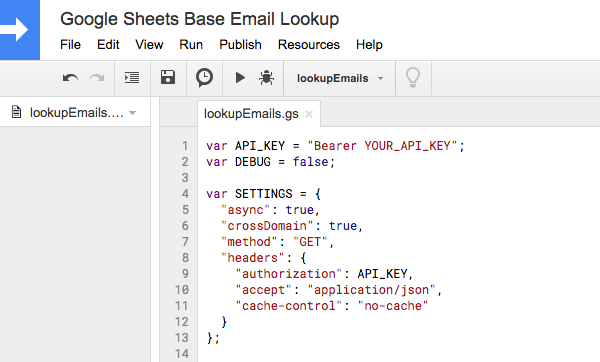

# Google Sheets/Base tools

Simple tools for doing Base things in Google Sheets:

1. Email lookup
2. Batch update fields

## Email lookup
Look up a list of emails in your Base account and get links to the Lead or Contact cards if they exist. Can return both a Lead and a Contact.

Note: if multiple records of the same type are found (for example, if multiple Leads exist with the same email), only the first URL will be displayed.

### Usage

1. Generate a Personal Access Token in your Base account. If you're having trouble, check out the [documentation](https://developers.getbase.com/docs/rest/articles/oauth2/introduction).

2. Add the code to a new script file, replacing YOUR_API_KEY with the token you just generated.

3. List your emails in the first column. It's not important what the headers are, but it's important that the header row exists since the script starts on the second row.

4. Make sure you run lookupEmails in the editor and not the other functions.

5. Your results should populate in the spreadsheet.

### Batch update fields 
Update fields on multiple Leads/Contacts in your Base account.
